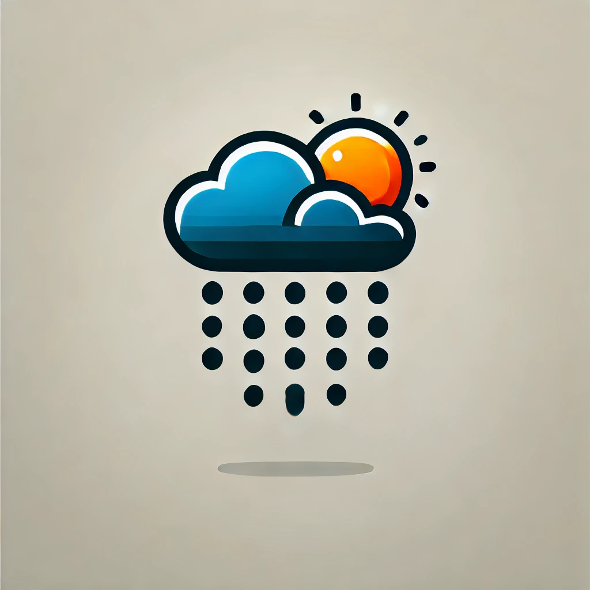

# WeatherView


WeatherView is a simple web application that allows users to get the current weather information for any city. The application uses the OpenWeatherMap API to fetch weather data and displays it on a map using OpenStreetMap.

## Features

- Search for weather information by city name.
- Display current weather conditions, including temperature and description.
- Show the location of the city on an interactive map using OpenStreetMap.
- Update weather information and map location without reloading the page.

## Technologies Used

- HTML
- CSS
- JavaScript
- Leaflet.js (for maps)
- OpenWeatherMap API (for weather data)
- Express.js (for the server)

## Installation

1. Clone the repository:

   ```bash
   git clone https://github.com/noa-trny/weather-view.git
   cd weather-view
   ```

2. Install the required dependencies:

   ```bash
   npm install
   ```


3. Start the server:

   ```bash
   npm start
   ```

4. Open your browser and navigate to `http://localhost:3000` to view the application.

## Usage

1. Enter the name of a city in the input field.
2. Click the "Get the weather" button.
3. The current weather information will be displayed, and the map will show the location of the city.

## API Reference

- **OpenWeatherMap API**: [OpenWeatherMap API Documentation](https://openweathermap.org/api)

## License

This project is licensed under the MIT License. See the [LICENSE](LICENSE) file for details.

## Acknowledgments

- [OpenStreetMap](https://www.openstreetmap.org/) for providing free map data.
- [Leaflet.js](https://leafletjs.com/) for the mapping library.
- [OpenWeatherMap](https://openweathermap.org/) for the weather data API.

 
